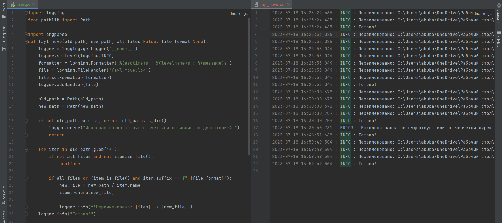

# Fayl_Move

##  File Move

> Это программа позволяет переименовывать файлы из одной папки и перемещать их в другую папку с помощью командной строки. Вы можете использовать аргументы командной строки для указания исходной папки, целевой папки, а также фильтровать файлы по формату.



**Пример программы так работает.**


## Установка

**Для запуска программы необходимо установить следующие зависимости:**

1. Установите Python >= (версия 3.11.4) на ваш компьютер.

2. Клонируйте репозиторий с GitHub:
    ```bash
    $  git clone git clone  https://github.com/Humoyun004/Fayl_Move.git
    ```
3. Перейдите в директорию с программой:
cd Fayl_Move


## Использование
1. **Откройте командную строку или терминал.**

2. **Перейдите в каталог, где находится файл main.py.**

**Запустите программу с помощью следующей команды:**
```bash
$ python main.py [--all] [--file_format FILE_FORMAT] old_path new_path 
```
**Пример:**
```bash
$ python main.py -all "C:/Users/abuba/OneDrive/Рабочий стол/old"  "C:/Users/abuba/OneDrive/Рабочий стол/new"

$ python main.py --format txt "C:/Users/abuba/OneDrive/Рабочий стол/old"  "C:/Users/abuba/OneDrive/Рабочий стол/new"
```

**Чтобы узнать свою директорию можеть посмотреть так:**
```bash
print(os.getcwd()) или print(pathlib.Path.cwd()) 
```
 

## Аргументы
- **old_path**: Путь к исходной папке, из которой нужно переместить файлы.
- **new_path**: Путь к целевой папке, в которую нужно переместить файлы.
- **new_path**: Путь к целевой папке, в которую нужно переместить файлы.
- **all**: Опциональный аргумент. Если указан, программа будет перемещать все файлы и папки из исходной папки. Если аргумент не указан, программа будет перемещать только файлы, а папки будут пропущены.
- **file_format FILE_FORMAT**: Опциональный аргумент. Фильтрует файлы по указанному формату. Например, если вы хотите переместить только файлы с расширением ".txt", укажите --file_format txt.


## Вклад
**Если вы хотите внести свой вклад в развитие приложения "File Move", пожалуйста, следуйте этим шагам:**

1. Форкните репозиторий на GitHub.
2. Клонируйте ваш форк репозитория на локальную машину.
3. Создайте новую ветку для вашей функции или исправления ошибки.
4. Внесите изменения и сделайте коммиты с описательными сообщениями.
5. Отправьте ваши изменения в ваш форк репозитория.
6. Создайте pull request (запрос на включение) в основной репозиторий.


## Важные замечания
- Пожалуйста, убедитесь, что вы вводите правильные пути к исходной и целевой папкам.
- Программа будет выполнять перемещение файлов без подтверждения, поэтому будьте осторожны, чтобы не потерять данные. Рекомендуется сделать резервные копии файлов перед использованием программы.
- Программа не будет перемещать подпапки, если не указан аргумент --all.

## Контакты
**Если у вас есть вопросы или предложения относительно приложения "File Move", пожалуйста, свяжитесь с нами по адресу humoyunakbaraliev1@gmail.com. Мы ценим ваше мнение!**


